# BasketTradingBO

**A walk-forward research framework for cointegration-based statistical arbitrage**, with Johansen
cointegration tests, a z-score trading state machine, a cash-accounting backtester, Gaussian-process
Bayesian optimisation of signal thresholds, and pre-registered evaluation with multiple-testing control.

[](https://github.com/shaunak-batra/BasketTradingBO/actions/workflows/tests.yml)

## Summary

The project asks one question: **does a textbook mean-reversion strategy on cointegrated baskets of
equities make money out of sample, after costs, when every estimate is made using only past data?**

To answer it credibly, the framework is built so that it cannot quietly flatter itself. Parameters are
estimated on a past window and frozen before trading the next one. Orders fill on the bar after the signal.
Equity moves only through mark-to-market profit and loss and costs. The protocol is fixed in a configuration
file before any result exists, its SHA-256 is recorded with every result, and significance is judged with probabilistic Sharpe ratios, bootstrap confidence
intervals and a false-discovery correction across every pair tested.

The answer is **no**, and the project measures why. Two experiments were run:

| | Experiment 1 (v2) | Experiment 2 (v3.0) |
|---|---|---|
| What was tested | 5 hand-picked baskets, fixed and Bayesian-optimised thresholds | 60 ETF pairs chosen by a pre-registered rule, with positive controls |
| Out-of-sample period | 2012 to 2024 (control basket from late 2022) | 2012 to 2024 |
| Statistically significant results | None (every PSR below 0.95) | 0 of 60 after Benjamini-Hochberg at 10% |
| Out-of-sample Sharpe ratio | From -0.41 to 0.12 across the 10 runs | Median -0.14 across the 42 traded pairs (-0.02 with no frictions) |
| Main finding | Losses came from unhedged baskets and a stop that could not fire; tuning overfit | Genuinely cointegrated spreads earn about 0.5 bps per trade against about 10 bps of cost |

The most informative evidence comes from two **positive controls**, GLD/IAU and IVV/SPY, which track the same
underlying assets. The pipeline correctly identified both as cointegrated and traded them more often than
almost any other pair, and both still produced the two lowest Sharpe ratios in the universe. At daily
frequency, the stable spreads are too small to pay for trading them, and the spreads large enough to pay
for trading are not stable.

Every number in this document is reproducible from the code in this repository and the price snapshots whose
SHA-256 hashes are recorded in each result file.

## Contents

- [1. The research question](#1-the-research-question)
- [2. Background: cointegration from first principles](#2-background-cointegration-from-first-principles)
- [3. From a spread to a trading signal](#3-from-a-spread-to-a-trading-signal)
- [4. The research framework](#4-the-research-framework)
- [5. Why version 1 was wrong](#5-why-version-1-was-wrong)
- [6. Experiment 1: five pre-registered baskets](#6-experiment-1-five-pre-registered-baskets)
- [7. From diagnosis to v3.0](#7-from-diagnosis-to-v30)
- [8. Experiment 2: sixty ETF pairs](#8-experiment-2-sixty-etf-pairs)
- [9. How the project fits together](#9-how-the-project-fits-together)
- [10. Reproducing the results](#10-reproducing-the-results)
- [11. Testing and verification](#11-testing-and-verification)
- [12. Repository layout](#12-repository-layout)
- [13. Limitations](#13-limitations)
- [14. Future work](#14-future-work)
- [15. References](#15-references)

## 1. The research question

Statistical arbitrage on pairs and baskets is one of the oldest quantitative trading ideas, and its classic academic test is
Gatev, Goetzmann and Rouwenhorst (2006). Find assets whose
prices share a long-run equilibrium, wait for them to drift apart, bet on convergence, and close the position
when they come back together. The idea is simple. Testing it honestly is not, because a backtest offers many
ways to leak information from the future into the past:

- estimating the hedge weights on the same data that is later traded;
- tuning thresholds on the evaluation period;
- filling orders at the price that generated the signal;
- ignoring transaction costs and short-borrow fees;
- choosing, after the fact, the baskets that happened to work;
- reading a high Sharpe ratio from a handful of trades as evidence of skill.

Each of these produces an attractive equity curve with no predictive value. The framework in this repository is
designed around removing every one of them, and then asking whether anything is left.

## 2. Background: cointegration from first principles

### 2.1 Why prices need special treatment

Daily stock prices behave approximately like random walks: tomorrow's log price is today's plus an
unpredictable shock. A random walk has no fixed mean to revert to, so a strategy that bets on a single price
returning to "normal" has no statistical basis.

Regressing one random walk on another is also dangerous. Two independent random walks routinely show a high
correlation and a significant regression slope purely by chance. This is the spurious regression problem
identified by Granger and Newbold (1974), and it is why correlation between price levels says almost nothing about
whether a pair will converge.

### 2.2 Cointegration

A set of non-stationary series is **cointegrated** if some linear combination of them is stationary. For log
prices $p_{i,t} = \log P_{i,t}$, that means there exist weights $w$ such that the spread

```math
S_t = \sum_i w_i \, p_{i,t}
```

has a constant mean and finite variance, even though each $p_{i,t}$ wanders without bound. The intuition is a
walker with a dog on a leash: each path is unpredictable, but the distance between them cannot grow forever.
Trading the spread means betting on the leash, not on either path.

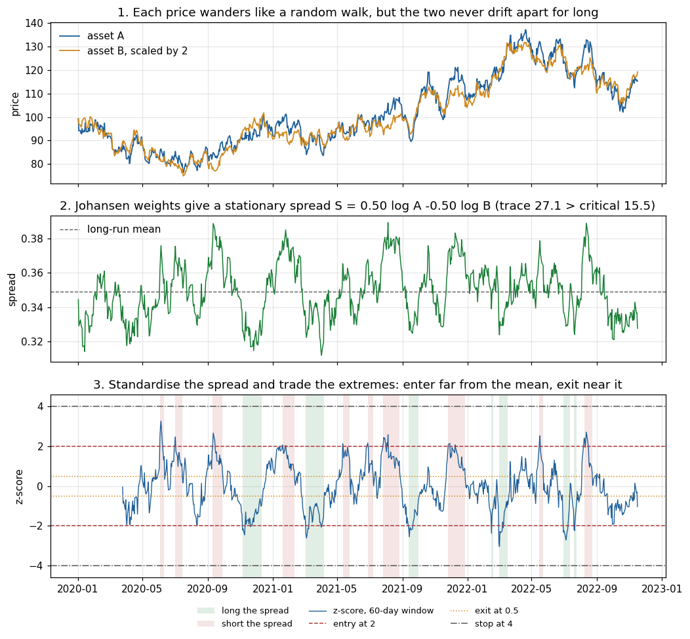

*Synthetic example built with the project's own functions. Top: two prices that wander together. Middle: the
Johansen weights turn them into a stationary spread. Bottom: the z-score of that spread and the positions the
signal state machine takes. Generated by `scripts/make_readme_figures.py`.*

### 2.3 The error-correction view and the Johansen test

Stacking the log prices into a vector $X_t$, a cointegrated system can be written as a vector error-correction
model (VECM):

```math
\Delta X_t = \Pi X_{t-1} + \Gamma_1 \Delta X_{t-1} + \mu + \varepsilon_t, \qquad \Pi = \alpha \beta^{\top}
```

The columns of $\beta$ are the cointegrating vectors, the equilibrium relationships, and $\alpha$ holds the
speeds at which each asset is pulled back towards equilibrium. The number of cointegrating relationships is the
rank $r$ of $\Pi$.

The **Johansen procedure** (Johansen, 1991) estimates the eigenvalues $\hat\lambda_1 \ge \dots \ge \hat\lambda_k$ associated
with $\Pi$ and tests the rank sequentially with the trace statistic:

```math
\lambda_{\text{trace}}(r) = -T \sum_{i=r+1}^{k} \ln\left(1 - \hat\lambda_i\right)
```

Large eigenvalues mean strong reversion, so a large trace statistic rejects "at most $r$ relationships". This
project trades a basket only if the trace test rejects rank zero at the 5% level, and it uses the eigenvector of
the largest eigenvalue as the basket weights, normalised so that $\sum_i |w_i| = 1$ with the first non-zero
weight positive ([src/cointegration/engine.py](src/cointegration/engine.py)).

Johansen is preferred to the two-step Engle-Granger test (Engle and Granger, 1987) because it handles more than two assets, does not
depend on which asset is chosen as the dependent variable, and tests the number of relationships directly. An
Engle-Granger test is implemented as a cross-check but is not used to produce any published result.

### 2.4 Why log prices

The spread is built from log prices on purpose. Differentiating the spread gives

```math
dS_t = \sum_i w_i \, d\log P_{i,t} \approx \sum_i w_i \, \frac{dP_{i,t}}{P_{i,t}}
```

which is exactly the return of a portfolio holding $w_i$ dollars of asset $i$ for each dollar of gross exposure.
With log prices the cointegrating weights are dollar allocations, so the statistical object being tested and the
portfolio being traded are the same thing. (The first version of this project tested raw prices and traded log
prices, which broke that link; see [section 5](#5-why-version-1-was-wrong).)

## 3. From a spread to a trading signal

### 3.1 How fast a spread reverts: the half-life

A stationary spread can be modelled in discrete time as a first-order autoregression around its mean $\mu$:

```math
S_t - \mu = \phi \, (S_{t-1} - \mu) + \varepsilon_t, \qquad 0 < \phi < 1
```

Taking expectations $h$ days ahead shows that a deviation decays geometrically:

```math
\mathbb{E}\left[S_{t+h} - \mu \mid S_t\right] = \phi^{h} \, (S_t - \mu)
```

The **half-life** is the horizon at which half of a deviation is expected to have disappeared, $\phi^{h} = 1/2$:

```math
h_{1/2} = \frac{\ln 0.5}{\ln \phi}
```

In practice $\phi$ is estimated by the regression $\Delta S_t = a + b\,S_{t-1} + e_t$, so that $\phi = 1 + b$
([src/cointegration/spread.py](src/cointegration/spread.py)). This is the discrete-time version of the
Ornstein-Uhlenbeck process $dS = \theta(\mu - S)\,dt + \sigma\,dW$, for which $\phi = e^{-\theta}$ and the half-life
is $\ln 2 / \theta$. If $\phi \ge 1$ there is no mean reversion and the half-life is infinite.

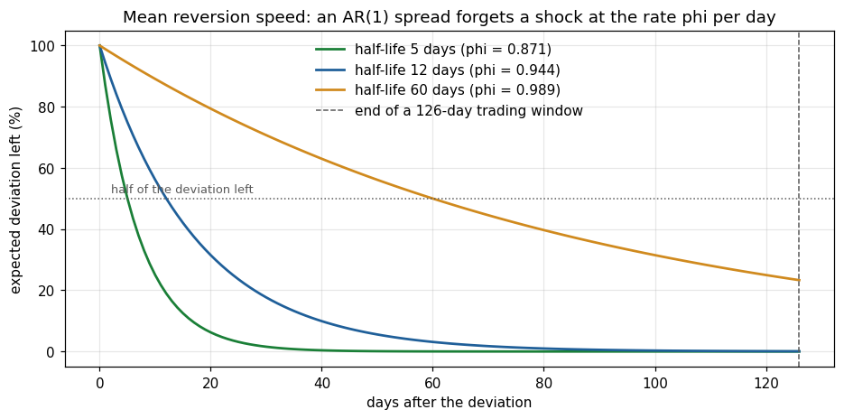

*A spread with a 12-day half-life (the median found in Experiment 1) has forgotten almost all of a shock within a
126-day trading window. A 60-day half-life still carries a quarter of it.*

### 3.2 The z-score

Deviations are measured in units of their own recent variability. For a lookback of $L$ days, using only bars up
to and including $t$:

```math
z_t = \frac{S_t - \bar S_{t-L+1:t}}{\mathrm{sd}\left(S_{t-L+1:t}\right)}
```

The z-score is undefined until $L$ observations exist. There is no expanding-window warm-up, so early signals
cannot be computed from a handful of points.

### 3.3 The signal state machine

The position is +1 (long the spread), -1 (short the spread) or 0 (flat), decided at each close
([src/strategy/signals.py](src/strategy/signals.py)). With entry threshold 2, exit threshold 0.5 and stop
threshold 4:

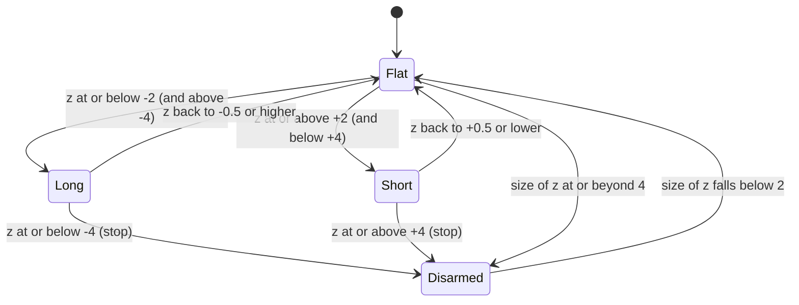

| From | To | Condition |
|---|---|---|
| flat | long | $-4 < z \le -2$ |
| flat | short | $2 \le z < 4$ |
| long | flat | $z \ge -0.5$ (converged) or $z \le -4$ (stop) |
| short | flat | $z \le 0.5$ (converged) or $z \ge 4$ (stop) |

After a stop, or when the absolute z-score is at or beyond the stop level while flat, the machine is
**disarmed** until the absolute z-score falls back inside the entry band, and the earliest new entry is the bar
after it re-arms. This prevents re-entering a spread that is still diverging. A missing z-score never opens a
position and leaves an open position unchanged.

## 4. The research framework

### 4.1 Architecture

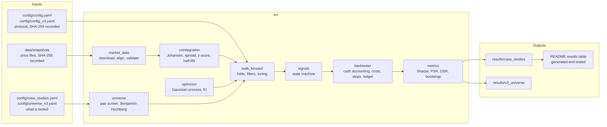

Every published number comes from the same walk-forward engine, `run_walk_forward` in
[src/backtesting/walk_forward.py](src/backtesting/walk_forward.py). For single baskets it is wrapped by
`run_research` in [src/pipeline.py](src/pipeline.py), which the command-line tool, the case-study runner and the
end-to-end tests all call. For the universe it is called once per pair by `evaluate_pair` in
[src/universe.py](src/universe.py).

### 4.2 Data

Daily split- and dividend-adjusted closes come from Yahoo Finance
([src/data/market_data.py](src/data/market_data.py)). Tickers are joined on common dates and missing prices are
never forward-filled. If aligning the tickers would drop more than 2% of dates, the run stops with the first
available date of each ticker rather than silently truncating the sample. Each download is saved as a CSV
snapshot and its SHA-256 is written into every result, so a result can always be traced to the exact input
file that produced it.

### 4.3 The walk-forward protocol

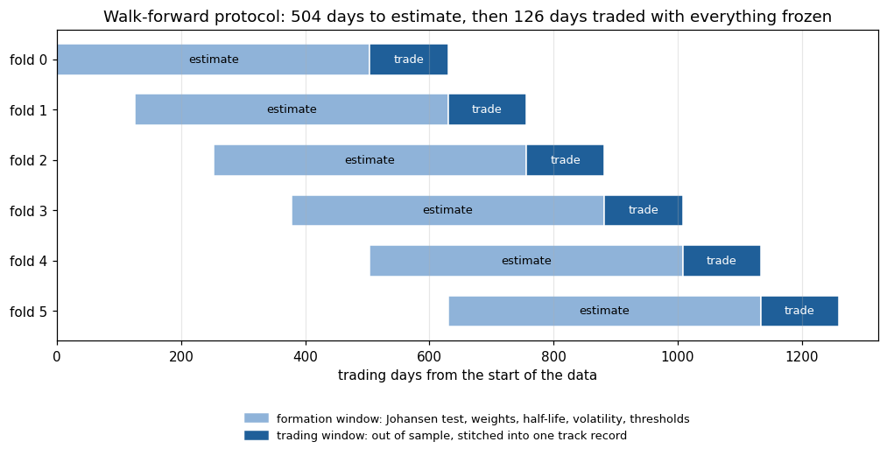

The sample is divided into folds ([src/backtesting/walk_forward.py](src/backtesting/walk_forward.py)). In each
fold:

1. **Estimate** on a 504-day formation window: run the Johansen test on log prices, take the weights, and
   estimate the spread's half-life and volatility.
2. **Filter**, in a fixed order. The fold is not traded if the basket is not cointegrated, if the basket is not
   hedged (v3.0 only), or if the half-life is longer than the 126-day trading window. The reason is recorded.
3. **Choose thresholds**: either the fixed textbook values, or values tuned by Bayesian optimisation on the
   formation window alone.
4. **Trade** the next 126 days with the weights, the thresholds and the gross exposure multiple frozen. The
   z-score window reaches back into the formation window, so the first trading day already has a full $L$-day
   window that uses only prices up to that day.
5. **Close** any open position at the end of the trading window.

Trading windows never overlap and equity carries from one fold to the next, so the folds stitch into a single
continuous out-of-sample track record.

### 4.4 Execution and cash accounting

The backtester ([src/backtesting/backtester.py](src/backtesting/backtester.py)) simulates daily closes. For a
vector of share holdings $q$, equity evolves as

```math
E_t = E_{t-1}
      + \underbrace{q_{t-1}\cdot\left(P_t - P_{t-1}\right)}_{\text{mark-to-market P\&L}}
      - \underbrace{\frac{b}{252}\sum_i \max(-q_{t-1,i},\,0)\,P_{t-1,i}}_{\text{borrow fee on shorts}}
      - \underbrace{c\sum_i \left|\Delta q_{t,i}\right| P_{t,i}}_{\text{trading cost}}
```

Buying or shorting shares exchanges cash for stock and never changes equity by itself. Only price moves and
costs do. The details that matter:

- **Next-bar execution.** A signal decided at the close of day $t$ is filled at the close of day $t+1$. Loss
  stops, time stops and the end-of-window close are executed at the close on which they are detected.
- **Costs.** $c$ is 5 basis points of traded notional per side, and $b$ is 50 basis points a year on short notional.
- **Sizing.** At entry, gross notional is a multiple of current equity, split across assets by $w_i / \sum_j |w_j|$.
  Shares are then held constant until exit, with no daily rebalancing.
- **Volatility targeting (v3.0).** The gross multiple is $\min\left(g_{\max},\ \sigma^{\star} / \hat\sigma_S\right)$,
  where $\hat\sigma_S = \mathrm{sd}(\Delta S)\sqrt{252}$ is estimated on the formation window and
  $\sigma^{\star} = 10\%$, $g_{\max} = 1$.
- **Risk stops (v3.0).** A loss stop closes a position once it has lost 10% of the equity it was sized on, and a
  time stop closes it after 36 days. After a risk stop, the same direction cannot be re-entered until the signal
  resets.
- **Trade ledger.** Every round trip is recorded with its dates, direction, exit reason, gross P&L, costs and
  return, and all trade statistics are computed from this ledger.

### 4.5 Bayesian optimisation of thresholds

In optimised mode, each fold's thresholds are chosen by Gaussian-process Bayesian optimisation on the
formation window ([src/optimization/optimizer.py](src/optimization/optimizer.py)). The objective is the
in-sample Sharpe ratio of a full backtest with the same costs as the out-of-sample run.

A Gaussian process places a prior over the unknown objective $f$ and, after each evaluation, gives a posterior
mean $\mu(x)$ and uncertainty $\sigma(x)$ at every untried point. The next point maximises **Expected
Improvement** (Jones, Schonlau and Welch, 1998) over the best value so far, $f^{\star}$:

```math
\mathrm{EI}(x) = \left(\mu(x) - f^{\star} - \xi\right)\Phi(Z) + \sigma(x)\,\varphi(Z), \qquad Z = \frac{\mu(x) - f^{\star} - \xi}{\sigma(x)}
```

Here $\xi = 0.01$ is a small exploration margin (the scikit-optimize default). The first term rewards points that
look good; the second rewards points that are uncertain. This balance lets the optimiser find good regions in 40
evaluations (12 Latin-hypercube starting points, then 28 guided ones) instead of an exhaustive grid, which is why
Gaussian-process optimisation is a standard tool for tuning expensive models (Snoek, Larochelle and Adams, 2012).

Two design choices keep the search honest:

- **Every point in the search box is a valid strategy.** Searching entry, exit and stop directly would produce
  invalid combinations such as an exit above the entry. The box is re-parameterised instead:
  $z_{\text{entry}} \in [1, 3]$, $z_{\text{exit}} = f \cdot z_{\text{entry}}$ with $f \in [0, 0.8]$,
  $z_{\text{stop}} = z_{\text{entry}} + d$ with $d \in [0.5, 3]$, and an integer lookback in $[20, 252]$.
- **Doing nothing is the baseline.** A parameter set with fewer than 3 in-sample round trips scores 0, the
  Sharpe ratio of staying flat. If no trial beats zero, the fold is not traded.

### 4.6 Statistics: telling skill from luck

All statistics are in [src/backtesting/metrics.py](src/backtesting/metrics.py) and use daily returns including
flat days, a zero risk-free rate, and 252 trading days a year.

**Sharpe ratio.** $\widehat{SR} = \bar r / s_r \cdot \sqrt{252}$.

**Probabilistic Sharpe ratio (PSR).** A Sharpe ratio estimated from $n$ observations is itself noisy, and more
so when returns are skewed or fat-tailed. Bailey and Lopez de Prado (2012) give the probability that the true
Sharpe ratio exceeds a benchmark $SR^{\star}$, using per-period Sharpe, skewness $\gamma_3$ and kurtosis
$\gamma_4$:

```math
\mathrm{PSR}\left(SR^{\star}\right) = \Phi\left(\frac{\left(\widehat{SR} - SR^{\star}\right)\sqrt{n-1}}{\sqrt{1 - \gamma_3\,\widehat{SR} + \frac{\gamma_4 - 1}{4}\,\widehat{SR}^{2}}}\right)
```

A PSR below 0.95 means the result cannot be distinguished from zero skill at the 95% level. The figure below
shows why short samples prove so little. With normal returns, two years of data need an annual Sharpe of 1.17
to reach PSR 0.95, while thirteen years need 0.46. A Sharpe of 0.12 over thirteen years, the best result in
Experiment 1, gives a PSR of only 0.67.

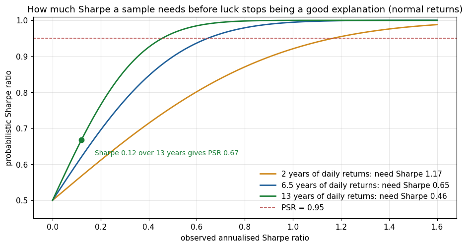

**Deflated Sharpe ratio (DSR).** Choosing the best of $N$ parameter sets inflates the winner's Sharpe ratio even
when none of them has skill. The DSR is the PSR measured against the Sharpe ratio expected from the best of $N$
skill-less trials (Bailey and Lopez de Prado, 2014), where $\gamma$ is the Euler-Mascheroni constant and
$\sigma_{SR}$ is the dispersion of the trial Sharpe ratios:

```math
SR^{\star} = \sigma_{SR}\left[(1-\gamma)\,\Phi^{-1}\!\left(1 - \frac{1}{N}\right) + \gamma\,\Phi^{-1}\!\left(1 - \frac{1}{N e}\right)\right]
```

**Block bootstrap confidence interval.** Positions last days or weeks, so daily returns are autocorrelated and an
ordinary bootstrap would understate uncertainty. The 95% interval is built from 2,000 resamples of 20-day blocks
(Kunsch, 1989), which preserves that dependence.

**False discovery control.** Testing sixty pairs at 5% would produce about three false positives with no skill at
all, and Harvey, Liu and Zhu (2016) show how widespread this problem is in empirical finance. Experiment 2
converts each pair's PSR into a one-sided p-value $1 - \mathrm{PSR}$, sorts them
$p_{(1)} \le \dots \le p_{(m)}$, and applies the Benjamini-Hochberg procedure (Benjamini and Hochberg, 1995) at
level $q = 10\%$:

```math
k = \max\left\{ i : p_{(i)} \le \frac{i}{m}\,q \right\}, \qquad \text{reject every } p \le p_{(k)}
```

This controls the expected share of false discoveries among the pairs declared significant
([src/universe.py](src/universe.py)). Pairs that never traded have no Sharpe ratio to test, so in Experiment 2
the procedure runs over the 42 pairs that traded.

### 4.7 Risk analytics

Every single-basket run reports daily Value-at-Risk at 95% and 99% by three methods
([src/risk/var.py](src/risk/var.py)): the empirical quantile, the Gaussian formulas, and a Cornish-Fisher
quantile that adjusts the normal quantile $z$ for sample skewness $S$ and excess kurtosis $K$:

```math
z_{CF} = z + \frac{(z^2 - 1)S}{6} + \frac{(z^3 - 3z)K}{24} - \frac{(2z^3 - 5z)S^2}{36}
```

Expected Shortfall is reported for the historical and Gaussian methods. These are descriptive analytics on
realised returns. They do not drive position sizing.

## 5. Why version 1 was wrong

The first version of this project published a Sharpe ratio, a drawdown, an optimiser that had found good
parameters, and a case study explaining the results. An audit showed that **every one of those numbers was an
artefact of the backtester, not of the strategy**. The core defect was a single line:

```python
portfolio_value = self.initial_capital + position_values - cumulative_costs
```

That formula adds the market value of the positions held to the starting capital, but never subtracts the cash
paid to acquire them. Opening a position therefore created equity equal to the position's net market value, and
closing it reset equity to capital minus costs. No trade could ever realise a genuine profit or loss.

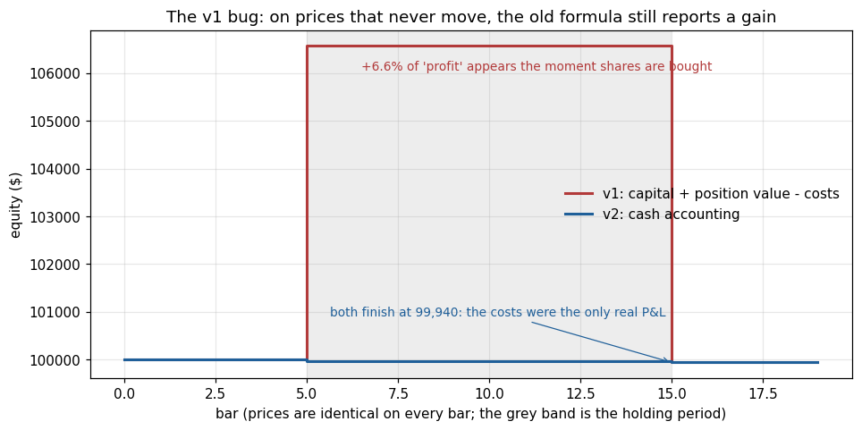

*On prices that never move, the v1 formula reports a 6.6% gain as soon as shares are bought, from 100,000 to
106,570. Cash accounting shows what actually happened: both versions end at 99,940, and the costs were the only
real P&L. The figure uses the v1 formula and the current backtester side by side.*

The audit found thirteen defects in total. The most consequential are below; [docs/AUDIT.md](docs/AUDIT.md) lists
all of them with evidence and the test that now guards against each one.

| v1 defect | Consequence | Fix and guard |
|---|---|---|
| Equity counted position value with no cash leg | Every reported return, Sharpe ratio and drawdown was fictitious | Cash accounting; a test that flat prices lose exactly the round-trip cost |
| When cointegration failed, hard-coded weights were traded silently | "Cointegrated" baskets that were not | Failing folds are not traded and the reason is recorded |
| Johansen on raw prices, trading on log prices | Tested object and traded portfolio differed | Log prices throughout |
| Weights and parameters fitted on the reported sample | Look-ahead by construction | Walk-forward protocol; tests that future prices cannot change past results |
| Signals filled on the bar that produced them | Same-bar look-ahead | Next-bar execution |
| Positions re-sized every day on initial capital, with costs charged daily | 416 "trades" reported for 6 round trips | Sized once at entry on current equity; one ledger row per round trip |
| Trade metrics computed over days, not trades | The reported 28% win rate was the share of positive days; 4 of 6 trades actually won | Statistics computed from the round-trip ledger |
| Headline figures in the old README matched no run | Claims with no evidence | README results table generated from result files and tested |

## 6. Experiment 1: five pre-registered baskets

### 6.1 Design

Five baskets were fixed in [config/case_studies.yaml](config/case_studies.yaml) before the corrected engine
produced any result: four with an economic reason to share a long-run driver (US money-centre banks, integrated
oil, beverages, and two commodity-exporting country funds) and one control with no such reason (TSLA, NFLX,
PLTR). Each basket was run with fixed thresholds (entry 2, exit 0.5, stop 4, 60-day lookback) and with
thresholds optimised per fold, under the protocol in [config/config.yaml](config/config.yaml).

### 6.2 Results

<!-- CASE_STUDY_RESULTS:START -->
| Basket | Mode | Out-of-sample | Folds traded | Closed trades | Total return | CAGR | Sharpe [95% CI] | PSR | Max drawdown | Sharpe at 0 / 20 bps |
|---|---|---|---|---|---|---|---|---|---|---|
| [JPM / BAC / C / WFC](results/case_studies/us_money_center_banks/fixed) | fixed | 2012-01 to 2024-12 | 1/26 | 3 | -0.6% | -0.1% | -0.05 [-0.47, 0.53] | 0.42 | -3.0% | -0.03 / -0.13 |
| [JPM / BAC / C / WFC](results/case_studies/us_money_center_banks/optimized) | optimized | 2012-01 to 2024-12 | 1/26 | 3 | -0.1% | -0.0% | -0.01 [-0.54, 0.37] | 0.49 | -2.7% | 0.02 / -0.09 |
| [XOM / CVX](results/case_studies/integrated_oil_xom_cvx/fixed) | fixed | 2012-01 to 2024-12 | 4/26 | 8 | -20.0% | -1.7% | -0.07 [-0.64, 0.53] | 0.39 | -51.8% | -0.07 / -0.09 |
| [XOM / CVX](results/case_studies/integrated_oil_xom_cvx/optimized) | optimized | 2012-01 to 2024-12 | 4/26 | 7 | -6.5% | -0.5% | -0.22 [-0.84, 0.45] | 0.20 | -15.1% | -0.20 / -0.30 |
| [KO / PEP](results/case_studies/consumer_staples_ko_pep/fixed) | fixed | 2012-01 to 2024-12 | 1/26 | 2 | 0.8% | 0.1% | 0.12 [-0.28, 0.39] | 0.67 | -1.4% | 0.15 / 0.03 |
| [KO / PEP](results/case_studies/consumer_staples_ko_pep/optimized) | optimized | 2012-01 to 2024-12 | 1/26 | 2 | 0.8% | 0.1% | 0.08 [-0.35, 0.37] | 0.61 | -2.0% | 0.09 / 0.02 |
| [EWA / EWC](results/case_studies/commodity_countries_ewa_ewc/fixed) | fixed | 2012-01 to 2024-12 | 9/26 | 25 | -1.4% | -0.1% | -0.02 [-0.41, 0.35] | 0.46 | -5.9% | 0.04 / -0.23 |
| [EWA / EWC](results/case_studies/commodity_countries_ewa_ewc/optimized) | optimized | 2012-01 to 2024-12 | 9/26 | 20 | -14.4% | -1.2% | -0.36 [-0.79, 0.08] | 0.09 | -15.8% | -0.31 / -0.51 |
| [TSLA / NFLX / PLTR](results/case_studies/control_tsla_nflx_pltr/fixed) | fixed | 2022-10 to 2024-12 | 3/5 | 6 | -19.5% | -9.3% | -0.41 [-1.88, 1.43] | 0.27 | -43.8% | -0.40 / -0.46 |
| [TSLA / NFLX / PLTR](results/case_studies/control_tsla_nflx_pltr/optimized) | optimized | 2022-10 to 2024-12 | 3/5 | 8 | -1.5% | -0.7% | 0.02 [-0.94, 1.55] | 0.51 | -21.4% | 0.05 / -0.06 |
<!-- CASE_STUDY_RESULTS:END -->

*This table is generated from the result files by `scripts/run_case_studies.py`, and a test fails if the two ever
disagree. Each linked folder holds the full HTML report, fold table, trade ledger and charts.*

### 6.3 Findings

**No result is statistically significant.** Every bootstrap interval contains zero and every PSR is below 0.95.
The best, 0.67 for KO/PEP, rests on two trades in thirteen years. Removing trading costs does not change this:
the zero-trading-cost Sharpe ratios range from -0.40 to 0.15.

**The cointegration filter rarely allows trading.** Over two-year formation windows, the banks and KO/PEP passed
the trace test in 1 of 26 windows, XOM/CVX in 4 and EWA/EWC in 9. Relationships commonly described as
cointegrated mostly are not, window by window. The control basket, with no economic link, passed in 3 of 5
windows, which prompted a check of the test itself. Simulation shows that with a constant term and no drift in
prices, the nominal 5% trace test rejects about 12% to 13% of the time; with meaningful drift it rejects about 5% to 6%.
The test was not changed mid-experiment, because that would break pre-registration.

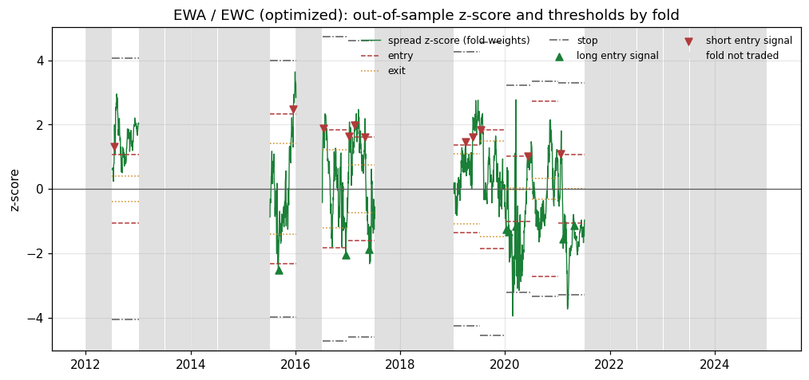

*EWA/EWC with optimised thresholds. Each traded fold has its own thresholds; grey bands are folds that were not
traded, and for this basket every one of them failed the Johansen test.*

**Optimisation overfit in a characteristic way.** Across the five baskets, the average in-sample Sharpe of traded
folds was 0.57 to 1.15 with fixed thresholds and 1.60 to 2.23 after Bayesian optimisation. Out of sample, those
same optimised folds averaged -0.61 to 0.49, and in-sample Sharpe correlated only about 0.2 with out-of-sample
Sharpe.

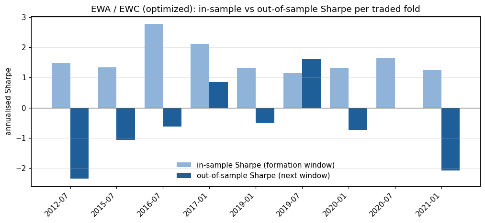

*For EWA/EWC all nine traded folds look good in-sample. Out of sample, six are negative, two are positive and one
never traded.* The deflated Sharpe ratios of the tuned folds averaged 0.73 to 0.94 and did not flag the problem,
because the dominant effect was not selection among many parameter sets but instability of the relationship
itself between the formation and trading windows.

**The largest losses were not spread trades.** Nothing requires a Johansen vector to have opposite signs. In
three of the four XOM/CVX folds that traded, both weights were positive, so "long the spread" meant long both oil
companies. The fixed-threshold run entered such a position on 22 January 2020 and held it into the COVID crash.

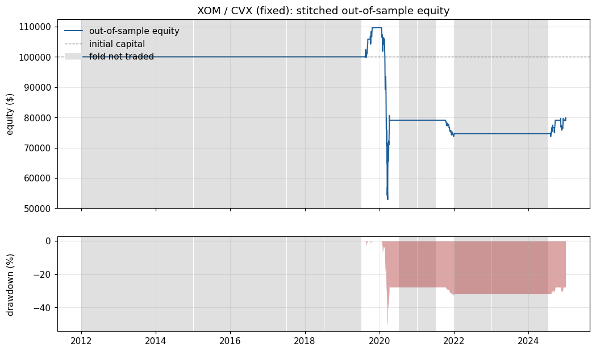

By 23 March the position had lost 51.8% of the equity it was sized on. The z-score stop at -4 never fired: the
crash inflated the 60-day standard deviation as fast as the loss grew, so the z-score bottomed at -3.73. The
trade closed on a normal exit signal on 9 April, down 27.9%. The worst trade in the control basket had the same
cause, with weights of +0.58, -0.19 and +0.22 leaving it about 60% net long through late 2022.

Two lessons follow directly. A cointegrating vector is not automatically a hedge, and a stop expressed in z-score
units is not a loss limit, because its yardstick stretches exactly when it matters.

## 7. From diagnosis to v3.0

### 7.1 Measured failures

Before changing anything, the Experiment 1 results were analysed ([docs/RESEARCH_V3.md](docs/RESEARCH_V3.md)):

| Observation from Experiment 1 | Measurement |
|---|---|
| Baskets were often unhedged | Net exposure above 20% of gross in 50% of the 36 traded folds |
| Deep losses never recovered | Of 84 closed trades, 3 fell 10% below entry equity and none recovered; 11 fell 5% below and only 1 of those closed with a profit |
| Spreads reverted quickly when cointegrated | Median formation half-life 12.2 days |
| Tuning did not transfer | In-sample to out-of-sample Sharpe correlation about 0.2 |

### 7.2 Three rules, each answering one failure

| Rule | Setting in [config/config_v3.yaml](config/config_v3.yaml) | Failure it answers |
|---|---|---|
| Require a hedged basket | `max_net_exposure: 0.20`, where net exposure is $\lvert\sum_i w_i\rvert / \sum_i \lvert w_i\rvert$ | Directional positions presented as spreads |
| Stop on money and on time | `stop_loss_fraction: 0.10`, `max_holding_bars: 36` (about three median half-lives) | A z-score stop that cannot fire in a crash |
| Size by risk | `target_volatility: 0.10`, `max_gross: 1.0` | Risk per trade depending on whatever the spread's volatility happened to be |

Signal thresholds, windows and costs stayed identical to Experiment 1, and optimisation was switched off because
it had cost more than it gained. All three rules default to off in the code, so Experiment 1 remains exactly
reproducible.

### 7.3 A fresh evaluation set

Every v3.0 rule was chosen after looking at Experiment 1's out-of-sample results, which makes those results
design data. Testing the new rules on the same baskets and calling it out of sample would reintroduce the very
bias the project exists to remove. Experiment 2 therefore uses a universe that Experiment 1 never touched, fixed
before any v3.0 result existed.

## 8. Experiment 2: sixty ETF pairs

### 8.1 Design

The universe in [config/universe_v3.yaml](config/universe_v3.yaml) is generated by a rule rather than chosen by
hand: 17 families of exchange-traded funds that share an economic driver, every unordered pair within a family,
and no pair across families. That yields 60 pairs. None of Experiment 1's tickers appears, and ETFs were chosen
because Yahoo carries no delisted stocks, which would make a single-stock universe survivorship-biased.

Two of the pairs are **positive controls**. GLD and IAU both hold gold bullion, and IVV and SPY both track the S&P
500. They are about as cointegrated as two instruments can be, so a working pipeline must find them. If it did
not, the pipeline would be broken and no negative result could be trusted.

Each pair is evaluated over the overlap of its two histories, requiring at least 1,000 shared days, and each pair is
also replayed with its trading decisions frozen at 0, 5, 10 and 20 bps and with no frictions at all
([scripts/run_universe.py](scripts/run_universe.py)).

### 8.2 Results

| | After costs | With no frictions |
|---|---|---|
| Pairs evaluated / pairs that traded | 60 / 42 | 60 / 42 |
| Median out-of-sample Sharpe (traded pairs) | **-0.14** | -0.02 |
| Pairs with positive Sharpe | 14 of 42 | 20 of 42 |
| Equal-weight portfolio, 2012 to 2024 | **-0.69%**, Sharpe -0.39 [-0.90, 0.08], PSR 0.08 | +0.31%, Sharpe 0.18 [-0.35, 0.66], PSR 0.74 |
| Significant after Benjamini-Hochberg at 10% | **0 of 60** | |

Of 1,560 folds, 176 were traded (11.3%). The rest were skipped because the basket was not cointegrated (1,276),
not hedged (102) or reverted too slowly (6). The 542 round trips produced 69 time-stop exits, 10 z-score stop
exits and **no loss-stop exits**: once positions were hedged and sized by risk, no trade lost 10% of the equity it
was sized on.

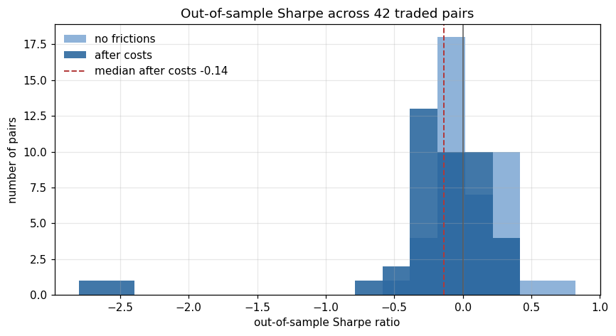

*After costs the median pair sits below zero and only 14 of 42 are positive. Removing every friction moves the
median back to roughly zero, not into profit. Costs are not hiding an edge; there is barely an edge to hide.*

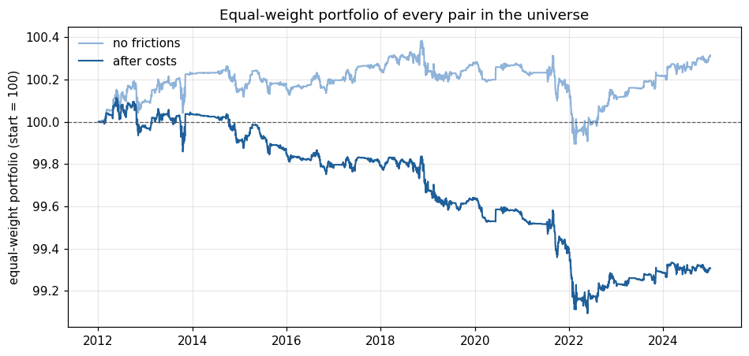

*An equal-weight portfolio of every pair. With no frictions it earns 0.31% in thirteen years, not per year.*

### 8.3 The positive controls

| Control | Folds traded | Round trips | Spread volatility | Gross P&L per trade | Cost per trade | Sharpe | Sharpe with no frictions |
|---|---|---|---|---|---|---|---|
| GLD/IAU | 24 of 26 | 119 | 0.57% a year | 0.53 bps | 10.32 bps | **-2.80** | +0.22 |
| IVV/SPY | 16 of 26 | 71 | 0.30% a year | 0.51 bps | 10.22 bps | **-2.43** | +0.21 |

GLD/IAU was traded in more folds than any other pair in the universe, and IVV/SPY was third, behind only the
high-yield bond funds HYG and JNK. The pipeline found exactly the relationships it should find. The two controls
also produced the two lowest Sharpe ratios in the universe, because the mispricing they capture is about twenty
times smaller than the cost of capturing it.

This is the central result in two rows. **Where cointegration is unambiguous, the tradable spread is tiny. Where
the spread is large enough to pay for trading, the cointegration is not stable enough to rely on.**

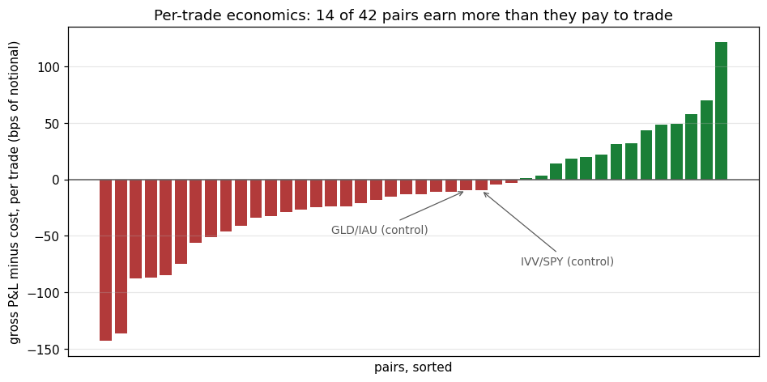

*Gross P&L minus cost per trade, by pair. Only 14 of the 42 traded pairs earn more per trade than they pay. Across
all 42, the median gross P&L per trade is -1.2 bps and the median cost is 12.1 bps.*

### 8.4 Why leverage cannot fix it

Volatility targeting would have taken about 17 times gross exposure on GLD/IAU and 33 times on IVV/SPY, and the 1x
cap prevented it. Removing the cap would not help, because profit and cost per trade both scale with the size of
the position. For gross edge $g$ and cost $c$ per unit of notional, and exposure $L$ as a multiple of equity:

```math
\text{net result per trade} = (g - c) \times L
```

With $g = 0.53$ bps and $c = 10.32$ bps, increasing $L$ multiplies a negative number.

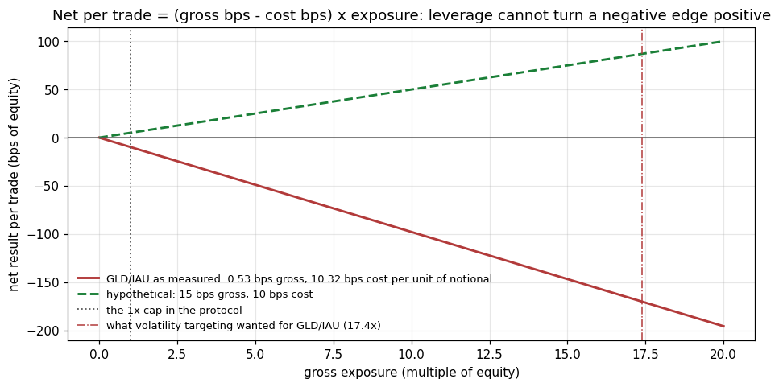

### 8.5 Cost sensitivity

Trading decisions frozen, only the per-side cost changed (borrow fees still charged):

| Cost per side | Median Sharpe | Pairs with positive Sharpe |
|---|---|---|
| 0 bps | -0.03 | 19 of 42 |
| 5 bps (protocol) | -0.14 | 14 of 42 |
| 10 bps | -0.24 | 12 of 42 |
| 20 bps | -0.34 | 8 of 42 |

### 8.6 Verdict against the pre-registered criteria

The success criteria were written in [docs/RESEARCH_V3.md](docs/RESEARCH_V3.md) before the run:

- *Promising* required a positive median out-of-sample Sharpe and more significant pairs than chance would
  produce. The median was -0.14 and there were no significant pairs: **not met**.
- *Not promising* was defined as a median Sharpe at or below zero across at least 50 pairs. The median was -0.14
  across 60 pairs: **met**.

The conclusion was therefore fixed before it was observed: **daily cointegration pairs trading on this universe,
with these costs, does not produce an edge.** The v3.0 rules did what they were designed to do. They removed
directional exposure and released stale positions, but they could not create an edge that the data does not
contain. Full detail is in [docs/RESULTS_V3.md](docs/RESULTS_V3.md).

## 9. How the project fits together

The project is best read as one research argument in four steps.

1. **A result that looked promising was false.** The original backtester manufactured profit from the act of
   buying shares. Finding it required a test with a known answer, not a test that the code runs.
2. **A rebuilt framework removed every avenue for self-deception.** Walk-forward estimation, next-bar execution,
   cash accounting, pre-registered protocols, and statistics that account for sample length, non-normality and
   selection. Under that framework, five sensible baskets showed no significant edge.
3. **The failures were diagnosed, not explained away.** Unhedged baskets, an unfireable stop and overfitting were
   measured, and each became a specific, testable rule.
4. **The rules were tested where they could not be flattered.** A rule-based universe that Experiment 1 never
   touched, positive controls, and a false-discovery correction produced a clear negative result with a
   mechanism: at daily frequency, the gross edge in stable spreads is about one twentieth of the cost of trading it.

The value of the project is not a trading strategy. It is a framework that can say "no" credibly, a
demonstration that it works (the controls), and a quantified explanation of why this family of strategies
fails under realistic conditions. That result is consistent with the literature documenting the decline of
simple pairs-trading profits (Do and Faff, 2010; Krauss, 2017).

## 10. Reproducing the results

Python 3.10 is required; CI runs on 3.10.

```bash
python -m venv venv
source venv/bin/activate            # Windows: venv\Scripts\activate
pip install -r requirements-dev.txt

pytest                              # full test suite, about 80 seconds, no network required
```

| Command | What it produces |
|---|---|
| `python scripts/run_pipeline.py --tickers KO PEP --start 2010-01-01 --end 2025-01-01 --mode fixed` | One basket: `results.json`, HTML report, fold table, trade ledger, daily equity, charts |
| `python scripts/run_case_studies.py` | All of Experiment 1, and regenerates the results table in this README |
| `python scripts/run_universe.py --config config/config_v3.yaml --universe config/universe_v3.yaml` | All of Experiment 2: `summary.json`, per-pair table, after-cost daily returns of every pair, charts |
| `python scripts/make_readme_figures.py` | The explanatory figures in `docs/figures/` |

Price data is not committed, because redistributing Yahoo data is not permitted. The first run downloads the
prices and writes a snapshot; later runs reuse it. Every result records the SHA-256 of the snapshot it used, so
if Yahoo revises its adjusted history and a re-download produces different numbers, the changed hash identifies
the cause. With the same snapshot, runs are deterministic: the optimiser and the bootstrap are seeded.

## 11. Testing and verification

The suite in [tests/](tests/) runs on every push through GitHub Actions
([.github/workflows/tests.yml](.github/workflows/tests.yml)). It needs no network, because the data layer is fed
synthetic prices. It contains 202 tests with 96% line coverage, in four groups.

- **Cases with known answers.** Flat prices lose exactly the round-trip cost; a known price move produces a known
  P&L; borrow fees, cost scaling, sizing, stops and re-entry rules match hand-computed values.
- **Invariants on random inputs (Hypothesis).** The change in equity always equals mark-to-market P&L minus costs,
  and always equals the sum of the trade ledger. Perturbing prices after any date never changes earlier equity,
  signals or z-scores. Every point in the optimiser's search box is a valid strategy.
- **Statistical behaviour.** The Johansen test recovers weights planted in synthetic data, its false-positive rate
  stays below a fixed ceiling with and without drift, the half-life estimator recovers a known AR(1) half-life, the
  PSR matches its closed form, and before costs the strategy makes money on a synthetic basket that genuinely
  mean-reverts, which confirms the framework can detect an edge when one exists.
- **Documentation and results.** A test fails if the results table in this README stops matching the result
  files, or if the README links to a file that does not exist.

The published results were also verified independently of the test suite: all ten Experiment 1 runs and all
sixty Experiment 2 pairs were re-run from the price snapshots with the current code and compared with the
previously committed result files. Every reported statistic, equity curve, fold and trade was identical; the only
changes were run timestamps and fields added for the v3.0 rules.

## 12. Repository layout

```text
.github/workflows/tests.yml    CI: runs the test suite on every push
config/
  config.yaml                  Experiment 1 protocol (fixed before any result)
  case_studies.yaml            the five Experiment 1 baskets
  config_v3.yaml               Experiment 2 protocol
  config_v3_draft.yaml         superseded draft of the Experiment 2 protocol, kept for the record
  universe_v3.yaml             the 60-pair universe and the rule that generates it
docs/
  AUDIT.md                     every v1 defect, its evidence, and the test that guards it
  RESEARCH_V3.md               analysis and literature behind the v3.0 rules, pre-registered criteria
  RESULTS_V3.md                Experiment 2 in full
  figures/                     explanatory figures used in this README
results/
  case_studies/                Experiment 1: summary files and one folder per basket and mode
  v3_universe/                 Experiment 2: summary, per-pair table, daily pair returns, charts
scripts/
  run_pipeline.py              one basket
  run_case_studies.py          Experiment 1, regenerates the README table
  run_universe.py              Experiment 2
  make_readme_figures.py       explanatory figures
src/
  data/market_data.py          download, alignment, validation, snapshots
  cointegration/engine.py      Johansen and Engle-Granger tests, weight normalisation, net exposure
  cointegration/spread.py      spread, z-score, half-life
  strategy/signals.py          signal state machine
  backtesting/backtester.py    cash accounting, costs, sizing, stops, trade ledger
  backtesting/walk_forward.py  fold protocol, filters, per-fold tuning, cost replay
  backtesting/metrics.py       Sharpe, Sortino, PSR, deflated Sharpe, block bootstrap, trade statistics
  optimization/optimizer.py    Gaussian-process Bayesian optimisation
  risk/var.py                  VaR and Expected Shortfall
  universe.py                  pair screening and Benjamini-Hochberg control
  utils/                       configuration loading, exceptions, file input and output
  visualization/plots.py       result charts
  visualization/reports.py     HTML report for each run
  visualization/summary.py     README results table
  visualization/explainers.py  explanatory figures for this README
  pipeline.py                  single-basket research run and command-line interface
tests/
  unit/                        hand-computed cases and Hypothesis properties, module by module
  integration/                 walk-forward, end-to-end, universe and documentation checks
  fixtures/synthetic.py        synthetic price generators, so no test needs the network
requirements.txt               pinned runtime dependencies
requirements-dev.txt           runtime dependencies plus test tooling
setup.py, pytest.ini           packaging and test configuration
```

## 13. Limitations

- **Selection and survivorship.** Experiment 2's families were defined by the researcher and contain only funds
  that still exist. ETFs greatly reduce, but do not remove, survivorship bias.
- **Cointegration test size.** With the constant deterministic term used here, the nominal 5% Johansen trace test
  rejects about 12% to 13% of the time on driftless random walks, so the cointegration filter is looser than its label.
- **Execution.** Signal fills occur at the next daily close with a flat cost per side, while risk stops fill at the
  close on which they are detected, which is slightly optimistic. There are no bid-ask dynamics,
  market impact, short-sale constraints or borrow recalls. Shares are fractional, short proceeds earn no rebate,
  and idle cash earns nothing.
- **Model.** The lag order and deterministic terms are fixed; weights are frozen for six months, so the dollar
  hedge drifts within a window; only the leading cointegrating vector is traded.
- **Statistics.** The p-values used for false-discovery control are asymptotic, and returns across pairs are
  correlated, so the control is approximate. Folds are short and trades few, which keeps confidence intervals wide.
- **Scope.** One frequency (daily), one window design (504 and 126 days) and one cost model. Other designs could
  behave differently, but testing them properly requires a new protocol and a fresh evaluation set.

## 14. Future work

The finding says the gross edge at daily frequency is roughly the size of the spread being crossed, so useful next
steps must change the economics rather than the parameters. Each would be a new protocol, frozen before running,
evaluated on data it has not seen.

1. **Execution.** Higher frequency or passive limit-order execution, where deviations are larger relative to costs.
2. **Signal construction.** Residuals from a factor model (Avellaneda and Lee, 2010) instead of pairwise
   cointegration, which provides more and larger deviations to trade.
3. **Structural relationships.** Dual-listed shares, ETF creation and redemption, or futures calendar spreads,
   where convergence is enforced by arbitrage mechanisms rather than inferred statistically.
4. **Dynamic hedge ratios.** A Kalman filter (Elliott, van der Hoek and Malcolm, 2005) so weights adapt within a
   trading window.
5. **A correctly sized test.** A bootstrap Johansen rank test (Cavaliere, Rahbek and Taylor, 2012) so the
   cointegration filter operates at its nominal level.

## 15. References

- Avellaneda, M. and Lee, J.-H. (2010). Statistical arbitrage in the US equities market. *Quantitative Finance*, 10(7).
- Bailey, D. H. and Lopez de Prado, M. (2012). The Sharpe ratio efficient frontier. *Journal of Risk*, 15(2).
- Bailey, D. H. and Lopez de Prado, M. (2014). The deflated Sharpe ratio: correcting for selection bias, backtest
  overfitting and non-normality. *Journal of Portfolio Management*, 40(5).
- Benjamini, Y. and Hochberg, Y. (1995). Controlling the false discovery rate: a practical and powerful approach
  to multiple testing. *Journal of the Royal Statistical Society, Series B*, 57(1).
- Cavaliere, G., Rahbek, A. and Taylor, A. M. R. (2012). Bootstrap determination of the co-integration rank in
  vector autoregressive models. *Econometrica*, 80(4).
- Do, B. and Faff, R. (2010). Does simple pairs trading still work? *Financial Analysts Journal*, 66(4).
- Elliott, R. J., van der Hoek, J. and Malcolm, W. P. (2005). Pairs trading. *Quantitative Finance*, 5(3).
- Engle, R. F. and Granger, C. W. J. (1987). Co-integration and error correction: representation, estimation and
  testing. *Econometrica*, 55(2).
- Gatev, E., Goetzmann, W. N. and Rouwenhorst, K. G. (2006). Pairs trading: performance of a relative-value
  arbitrage rule. *Review of Financial Studies*, 19(3).
- Granger, C. W. J. and Newbold, P. (1974). Spurious regressions in econometrics. *Journal of Econometrics*, 2(2).
- Harvey, C. R., Liu, Y. and Zhu, H. (2016). ... and the cross-section of expected returns. *Review of Financial
  Studies*, 29(1).
- Johansen, S. (1991). Estimation and hypothesis testing of cointegration vectors in Gaussian vector
  autoregressive models. *Econometrica*, 59(6).
- Jones, D. R., Schonlau, M. and Welch, W. J. (1998). Efficient global optimization of expensive black-box
  functions. *Journal of Global Optimization*, 13(4).
- Krauss, C. (2017). Statistical arbitrage pairs trading strategies: review and outlook. *Journal of Economic
  Surveys*, 31(2).
- Kunsch, H. R. (1989). The jackknife and the bootstrap for general stationary observations. *Annals of
  Statistics*, 17(3).
- Snoek, J., Larochelle, H. and Adams, R. P. (2012). Practical Bayesian optimization of machine learning
  algorithms. *Advances in Neural Information Processing Systems*, 25.

## Disclaimer

This repository is for research and education. It is not investment advice.
