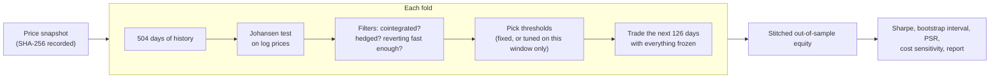

# BasketTradingBO

I wanted to know whether a classic statistical arbitrage idea actually makes money: find groups of
stocks or funds whose prices move together in the long run, trade the gaps when they open up, and
collect when they close. This repo is my attempt to answer that honestly, with a backtest that is hard
to fool.

The answer turned out to be no, and I think the reason is more interesting than a yes would have been.
At daily frequency, the spreads that are genuinely stable are worth about half a basis point per trade,
and it costs about ten basis points to trade them.

Everything below is out of sample, after costs, and reproducible from the code and the price snapshots
recorded in each result file.

## Contents

- [The short version](#the-short-version)
- [What the strategy is trying to do](#what-the-strategy-is-trying-to-do)
- [The bug that made me rebuild everything](#the-bug-that-made-me-rebuild-everything)
- [How I test it now](#how-i-test-it-now)
- [Round one: five baskets I picked myself](#round-one-five-baskets-i-picked-myself)
- [What I changed after that](#what-i-changed-after-that)
- [Round two: sixty pairs I did not pick](#round-two-sixty-pairs-i-did-not-pick)
- [What I take away from this](#what-i-take-away-from-this)
- [Running it](#running-it)
- [How it is tested](#how-it-is-tested)
- [What is in the repo](#what-is-in-the-repo)
- [Things this does not do](#things-this-does-not-do)
- [Where I would go next](#where-i-would-go-next)
- [References](#references)

## The short version

I built a walk-forward research framework for cointegration pairs and baskets: Johansen tests for the
relationship, a z-score state machine for the signals, a backtester that tracks cash properly, and
Bayesian optimisation for the thresholds. Then I tested it twice.

**Round one** was five baskets I chose myself, over 2012 to 2024. Nothing was statistically
distinguishable from zero. The worst losses came from baskets that were not actually hedged.

**Round two** was sixty ETF pairs chosen by a rule I fixed in advance, with two pairs thrown in as
controls because they track the same thing and must be cointegrated. Zero of the sixty survived a
false-discovery correction. The two controls traded more often than any real candidate, which told me
the machinery works, and they were also the two worst performers, which told me why the whole idea
fails: they earned 0.5 basis points per trade and paid 10.

I also found and fixed a bug in my own first version that had been inventing profits. That story is in
[docs/AUDIT.md](docs/AUDIT.md) and it is the part I would want to be asked about.

## What the strategy is trying to do

Two things that are economically linked, say Australia and Canada country funds, tend to wander apart
and come back. Correlation is not enough for this, because two prices can move together every day and
still drift apart forever. What you need is cointegration: some fixed combination of the prices that
is stationary, meaning it has a stable average to revert to.

I use the Johansen test on log prices to find that combination. It gives me a weight per asset, and the
weighted sum of log prices is what I call the spread:

```math
S_t = \sum_i w_i \log P_{i,t}, \qquad \sum_i |w_i| = 1
```

Log prices are deliberate. With logs, a weight is directly a dollar allocation, so the statistics and
the trading agree with each other. My first version tested raw prices and then traded log prices, which
is one of the things that was wrong with it.

Then I standardise the spread into a z-score over a trailing window and trade the extremes:

| From | To | When |
|---|---|---|
| flat | long the spread | z drops to -2 (and is not already past -4) |
| flat | short the spread | z rises to +2 (and is not already past +4) |
| long | flat | z comes back to -0.5, or falls to -4 (stop) |
| short | flat | z comes back to +0.5, or rises to +4 (stop) |

Here is what that looks like on real data. Green triangles are long entries, red are shorts, and the
grey bands are windows where the test said the pair was not cointegrated so nothing was traded:


The thresholds change between windows in that picture because this was the run where I let Bayesian
optimisation choose them. More on how that went later.

## The bug that made me rebuild everything

My first version reported a Sharpe ratio, a drawdown, an optimiser that had "found" good parameters,
and a case study explaining the results. All of it was fiction, and here is the line that did it:

```python
portfolio_value = self.initial_capital + position_values - cumulative_costs
```

That adds the market value of whatever I am holding to my capital. But buying something is an exchange,
not a gain: cash goes out, shares come in, and equity should not move. With that formula, opening a
position instantly changed my equity by the value of the position, and closing it snapped equity back to
capital minus costs. No trade could ever record a real profit or loss.

I found it by running the simplest test I could think of. Hold prices completely flat, open a position,
close it. Nothing should happen except costs. Instead equity jumped from 100,000 to 106,570 on entry and
came back to 99,940 at exit. That test is now in the suite permanently.

The fix is to only let equity move when something real happens:

```math
E_t = E_{t-1} + \underbrace{q_{t-1}\cdot(P_t - P_{t-1})}_{\text{today's P\&L on yesterday's shares}}
      - \underbrace{\tfrac{b}{252}\sum_i \max(-q_{t-1,i},0)\,P_{t-1,i}}_{\text{cost of borrowing the shorts}}
      - \underbrace{c\sum_i |\Delta q_{t,i}|\,P_{t,i}}_{\text{cost of trading}}
```

While I was in there I found nine more problems, including a pipeline that quietly substituted
hardcoded weights whenever the cointegration test failed, and a "trade count" that was really counting
days. [docs/AUDIT.md](docs/AUDIT.md) lists all thirteen, each with the evidence and the test that now
stops it from coming back.

The general lesson I took: a backtest that runs is not a backtest that works. Test the accounting
identities, not just the happy path.

## How I test it now

The whole design is built around not fooling myself.

**Estimate on the past, trade the future.** Every six months of trading gets its own two years of
history beforehand. The cointegration test, the weights, the half-life, and the parameters all come
from those two years. Then the settings are frozen and the next six months are traded blind. Windows
never overlap, and equity carries across, so the whole thing stitches into one continuous track record.



**Signals cannot see the bar they trade on.** A signal computed at today's close is filled at
tomorrow's close. The z-score uses a trailing window with no partial windows at the start. There are
tests that take random prices, shock everything after a random date, and assert that nothing before
that date moved by a single floating point bit.

**Costs are real.** Five basis points a side, which is reasonable for liquid funds, plus fifty basis
points a year to borrow the short leg. Every run is also replayed at zero, ten and twenty basis points
so the cost assumption is visible rather than buried.

**Decide what counts as success before running.** The protocol lives in a config file
([config/config.yaml](config/config.yaml)), the SHA-256 of that file goes into every result, and the
baskets were chosen and written down before anything was run. That is the only way "out of sample"
means anything.

**Judge significance properly.** A single Sharpe ratio on a few trades tells you nothing. I report a
95% block bootstrap interval, the probabilistic Sharpe ratio (the chance the true Sharpe is above zero,
given how skewed and fat-tailed the returns are), and when parameters are tuned, the deflated Sharpe
ratio, which accounts for having tried many parameter sets.

## Round one: five baskets I picked myself

Four with an economic reason to expect a relationship, and one deliberate control with no reason at all.
Both modes: fixed textbook thresholds, and thresholds tuned per window by Bayesian optimisation.

<!-- CASE_STUDY_RESULTS:START -->
| Basket | Mode | Out-of-sample | Folds traded | Closed trades | Total return | CAGR | Sharpe [95% CI] | PSR | Max drawdown | Sharpe at 0 / 20 bps |
|---|---|---|---|---|---|---|---|---|---|---|
| [JPM / BAC / C / WFC](results/case_studies/us_money_center_banks/fixed) | fixed | 2012-01 to 2024-12 | 1/26 | 3 | -0.6% | -0.1% | -0.05 [-0.47, 0.53] | 0.42 | -3.0% | -0.03 / -0.13 |
| [JPM / BAC / C / WFC](results/case_studies/us_money_center_banks/optimized) | optimized | 2012-01 to 2024-12 | 1/26 | 3 | -0.1% | -0.0% | -0.01 [-0.54, 0.37] | 0.49 | -2.7% | 0.02 / -0.09 |
| [XOM / CVX](results/case_studies/integrated_oil_xom_cvx/fixed) | fixed | 2012-01 to 2024-12 | 4/26 | 8 | -20.0% | -1.7% | -0.07 [-0.64, 0.53] | 0.39 | -51.8% | -0.07 / -0.09 |
| [XOM / CVX](results/case_studies/integrated_oil_xom_cvx/optimized) | optimized | 2012-01 to 2024-12 | 4/26 | 7 | -6.5% | -0.5% | -0.22 [-0.84, 0.45] | 0.20 | -15.1% | -0.20 / -0.30 |
| [KO / PEP](results/case_studies/consumer_staples_ko_pep/fixed) | fixed | 2012-01 to 2024-12 | 1/26 | 2 | 0.8% | 0.1% | 0.12 [-0.28, 0.39] | 0.67 | -1.4% | 0.15 / 0.03 |
| [KO / PEP](results/case_studies/consumer_staples_ko_pep/optimized) | optimized | 2012-01 to 2024-12 | 1/26 | 2 | 0.8% | 0.1% | 0.08 [-0.35, 0.37] | 0.61 | -2.0% | 0.09 / 0.02 |
| [EWA / EWC](results/case_studies/commodity_countries_ewa_ewc/fixed) | fixed | 2012-01 to 2024-12 | 9/26 | 25 | -1.4% | -0.1% | -0.02 [-0.41, 0.35] | 0.46 | -5.9% | 0.04 / -0.23 |
| [EWA / EWC](results/case_studies/commodity_countries_ewa_ewc/optimized) | optimized | 2012-01 to 2024-12 | 9/26 | 20 | -14.4% | -1.2% | -0.36 [-0.79, 0.08] | 0.09 | -15.8% | -0.31 / -0.51 |
| [TSLA / NFLX / PLTR](results/case_studies/control_tsla_nflx_pltr/fixed) | fixed | 2022-10 to 2024-12 | 3/5 | 6 | -19.5% | -9.3% | -0.41 [-1.88, 1.43] | 0.27 | -43.8% | -0.40 / -0.46 |
| [TSLA / NFLX / PLTR](results/case_studies/control_tsla_nflx_pltr/optimized) | optimized | 2022-10 to 2024-12 | 3/5 | 8 | -1.5% | -0.7% | 0.02 [-0.94, 1.55] | 0.51 | -21.4% | 0.05 / -0.06 |
<!-- CASE_STUDY_RESULTS:END -->

This table is generated from the result files by `scripts/run_case_studies.py`, and a test fails if it
ever disagrees with them. PSR is the probability the true Sharpe is above zero. Below 0.95 means I
cannot distinguish the result from luck.

Four things stood out.

**Nothing was significant.** Every confidence interval contains zero. The best PSR in the table is
0.67, on a basket that traded twice in thirteen years. Setting costs to zero does not save it either:
the zero-cost Sharpe ratios run from -0.40 to 0.15.

**The cointegration filter almost never opened the gate.** Over two-year windows, the banks passed the
test in 1 of 26 windows. So did Coke and Pepsi. Pairs that everyone describes as cointegrated mostly
are not, window by window, and the book sits in cash. Meanwhile my control basket, the one with no
economic link at all, passed in 3 of 5 windows. That bothered me enough to check the test itself, and it
turns out the version I use over-rejects: on random walks with no drift it flags cointegration about 12%
of the time at a nominal 5%. I left it alone rather than change the rules mid-experiment, and wrote it
down as a limitation.

**Tuning made things worse, in a very recognisable way.** Bayesian optimisation lifted the in-sample
Sharpe per basket to between 1.6 and 2.2, up from 0.57 to 1.15 with fixed thresholds. Out of sample,
those same tuned windows averaged between -0.61 and 0.49. Here is one basket, window by window, light
blue in-sample and dark blue out-of-sample:


Eight of nine windows look good in-sample. Six of nine are negative out of sample. The deflated Sharpe
ratio, which is supposed to catch exactly this by penalising the number of parameter sets tried,
averaged 0.73 to 0.97 and did not flag it. That is worth understanding: the problem was not only that I
tried many parameters, it is that the relationship itself changed between the estimation window and the
trading window.

**The big losses were not really spread trades.** The Johansen vector does not have to have opposite
signs, and in three of the XOM/CVX windows both weights came out positive. "Long the spread" then means
long both oil companies. The fixed run bought that on 22 January 2020 and held it into the COVID crash:


Down 52% of the equity it was sized on by 23 March. The z-score stop at -4 never fired, because the
crash blew up the 60-day standard deviation just as fast as the loss grew, so in z terms the position
never looked more than 3.73 standard deviations offside. It finally closed on a normal exit signal in
April, down 27.9%. The worst trade in the control basket had the same shape: weights of +0.58, -0.19 and
+0.22, about 60% net long, in the Q4 2022 tech selloff.

Two clear lessons. A cointegrating vector is not automatically a hedge. And a stop defined in z-score
units is not a loss limit, because its yardstick stretches exactly when you need it to hold still.

## What I changed after that

Three rules, each one answering something I had measured rather than something I imagined:

| Change | Setting | Why |
|---|---|---|
| Require the basket to be hedged | `max_net_exposure: 0.20` | Half of all traded windows had more than 20% of gross as net directional exposure |
| Stop on money, not on z | `stop_loss_fraction: 0.10` | Of 84 trades in round one, none that fell 10% ever recovered; a 10% stop would have cut zero winners |
| Let go of stale positions | `max_holding_bars: 36` | Roughly three times the median half-life |
| Size by risk, not by a fixed number | `target_volatility: 0.10`, `max_gross: 1.0` | Fixed 1x gross made risk per trade depend on whatever the spread's volatility happened to be |

All three default to off, so round one stays reproducible exactly as published.

Then the awkward part. Every one of those rules came from looking at round one's out-of-sample results,
which makes those results design data. Testing the new rules on the same five baskets and calling it
out of sample would be exactly the sin this project exists to avoid. So round two needed a different
universe.

## Round two: sixty pairs I did not pick

I wrote down a rule instead of choosing baskets: 17 families of ETFs that share an economic driver,
every pair inside a family, no pairs across families, and none of the tickers from round one. That
gives 60 pairs ([config/universe_v3.yaml](config/universe_v3.yaml)).

Two of those families exist as **positive controls**: GLD and IAU are both gold, IVV and SPY are both
the S&P 500. They are as cointegrated as two things can be. If my pipeline did not find them, my
pipeline was broken and nothing else it said would mean anything.

Because sixty tests at 5% each would throw up three false positives by accident, significance is
judged after a Benjamini-Hochberg false discovery correction across all sixty.

**The result: zero discoveries out of sixty.**

| | After costs | With no frictions at all |
|---|---|---|
| Median Sharpe across the 42 pairs that traded | **-0.14** | -0.02 |
| Pairs with a positive Sharpe | 14 of 42 | 20 of 42 |
| Equal-weight portfolio, 2012 to 2024 | **-0.69%** total, Sharpe -0.39 | +0.31% total, Sharpe 0.18 |
| Discoveries after correction | **0 of 60** | |


The whole distribution sits left of zero, and taking costs away shifts it back to roughly zero rather
than into profit. That is the thing to notice: there is no hidden edge that costs are eating. There is
barely an edge at all.


Thirteen years, sixty pairs, and the frictionless version makes 0.31%. Not 0.31% a year. In total.

### The controls are the punchline

| Control | Windows traded | Trades | Spread volatility | Gross per trade | Cost per trade | Sharpe | Sharpe with no frictions |
|---|---|---|---|---|---|---|---|
| GLD/IAU | 24 of 26 | 119 | 0.6%/yr | **0.53 bps** | **10.3 bps** | **-2.80** | +0.22 |
| IVV/SPY | 16 of 26 | 71 | 0.3%/yr | **0.51 bps** | **10.2 bps** | **-2.43** | +0.21 |

These two traded more windows than any genuine candidate in the universe, which is exactly what should
happen, because they really are cointegrated. The machinery works. They were also the two worst
performers out of sixty, because the mispricing they capture is about twenty times smaller than the cost
of capturing it.

That is the entire finding in two rows. Where cointegration is unambiguous, the spread is tiny. Where
the spread is big enough to pay for the trading, the cointegration is not stable enough to rely on.


Only 14 of the 42 pairs that traded earned more per trade than they paid to trade. The median pair lost
1.2 basis points gross and paid 12.1.

### No, leverage does not fix this

This was my first instinct too, so I worked it through. Volatility targeting actually wanted about 17x
on those quiet spreads, and my 1x cap stopped it. Lifting the cap would not have helped, because both
sides of the trade scale with position size:

```
net per trade = (gross bps - cost bps) x notional
```

With gross at 0.5 and cost at 10, a bigger notional just multiplies a negative number. Leverage changes
the size of the answer, not its sign.

### Cost sensitivity

Same trades, same windows, only the cost assumption changed:

| Cost per side | Median Sharpe | Pairs positive |
|---|---|---|
| 0 bps | -0.03 | 19 of 42 |
| 5 bps (what I use) | -0.14 | 14 of 42 |
| 10 bps | -0.24 | 12 of 42 |
| 20 bps | -0.34 | 8 of 42 |

I had pre-registered what would count as a failure: a median Sharpe at or below zero across at least 50
baskets. Median -0.14 across 60. So the conclusion was fixed before I saw it, and it is that this
strategy family does not work at daily frequency with these costs. Full write-up in
[docs/RESULTS_V3.md](docs/RESULTS_V3.md), raw numbers in [results/v3_universe/](results/v3_universe/).

## What I take away from this

**A backtest that runs proves nothing.** Mine ran fine for weeks while inventing profits out of position
values. What caught it was a test with an answer I already knew: flat prices, one round trip, lose
exactly the costs.

**Most of the work is in not fooling yourself.** Next-bar execution, trailing windows, fixed protocols,
separate evaluation universes, false-discovery correction. None of that is glamorous and all of it is
what makes the number at the end mean something.

**Controls belong in backtests.** Adding two pairs that must be cointegrated turned an ambiguous
negative result into a diagnosis. Without them I could not have separated "my code is broken" from "the
economics do not work", and those need completely different responses.

**In-sample performance is nearly free.** I can produce a 2.0 Sharpe in-sample by asking an optimiser
nicely. It means nothing. The gap between 1.6-2.2 in-sample and roughly zero out-of-sample is the whole
game.

**Know the size of the edge you need.** Everything here hinges on one comparison: half a basis point of
gross against ten of cost. Working that out early would have saved a lot of backtesting.

## Running it

You need Python 3.10.

```bash
python -m venv venv
source venv/bin/activate          # Windows: venv\Scripts\activate
pip install -r requirements-dev.txt

pytest                            # about a minute, no network needed
```

One basket:

```bash
python scripts/run_pipeline.py --tickers KO PEP --start 2010-01-01 --end 2025-01-01 --mode fixed
```

Everything from round one, which also regenerates the table in this README:

```bash
python scripts/run_case_studies.py
```

Round two, the sixty-pair universe:

```bash
python scripts/run_universe.py --config config/config_v3.yaml --universe config/universe_v3.yaml
```

Each run writes `results.json` with every statistic and its provenance, an HTML report, the trade
ledger, the daily equity, and charts.

Price data is not in the repo, because redistributing Yahoo data is not mine to do. The first run
downloads it and saves a snapshot; every result records that snapshot's SHA-256. If you re-download
later and Yahoo has revised its adjusted prices, the hash will not match and you will know why your
numbers moved. With the same snapshot, runs are identical: the optimiser and the bootstrap are seeded.

## How it is tested

195 tests, about 92% coverage, running in CI on every push
([.github/workflows/tests.yml](.github/workflows/tests.yml)). No network required, because the data
layer is fed synthetic prices.

The parts I care about most:

- **Cases where I already know the answer.** Flat prices lose exactly the round trip cost. A known price
  move produces a known P&L. Borrow fees, cost scaling and position sizing all match numbers worked out
  by hand.
- **Invariants on random inputs**, using Hypothesis. Equity change always equals P&L minus costs, and
  always equals the sum of the trade ledger. Shocking prices after any date never changes any earlier
  equity, signal or z-score. Every corner of the optimiser's search space is a valid parameter set.
- **Statistical behaviour.** Johansen recovers weights I planted in synthetic data. Its false-positive
  rate is pinned both with and without drift. The half-life estimator recovers a known AR(1) half-life.
  The strategy does make money on a synthetic basket that really does mean-revert, which is the sanity
  check that the whole thing can detect an edge when one exists.
- **Documentation.** A test fails if the results table above stops matching the result files, or if the
  README links to something that does not exist.

## What is in the repo

```text
config/
  config.yaml              round one protocol, fixed before running
  case_studies.yaml        the five baskets
  config_v3.yaml           round two protocol
  universe_v3.yaml         the 60-pair universe and the rule that built it
docs/
  AUDIT.md                 what was wrong with v1 and the test guarding each fix
  RESEARCH_V3.md           evidence and literature behind the v3 changes
  RESULTS_V3.md            the universe results in full
results/
  case_studies/            round one output, one folder per basket and mode
  v3_universe/             round two output
scripts/
  run_pipeline.py          one basket
  run_case_studies.py      all five, regenerates the README table
  run_universe.py          the universe screen
src/
  data/market_data.py          download, align, validate, snapshot
  cointegration/engine.py      Johansen and Engle-Granger
  cointegration/spread.py      spread, z-score, half-life
  strategy/signals.py          the signal state machine
  backtesting/backtester.py    cash accounting, costs, stops, trade ledger
  backtesting/walk_forward.py  the fold protocol
  backtesting/metrics.py       Sharpe, PSR, deflated Sharpe, bootstrap
  optimization/optimizer.py    Gaussian process Bayesian optimisation
  risk/var.py                  VaR and expected shortfall
  universe.py                  universe screening and false-discovery control
  visualization/               charts, HTML reports, the README table
  pipeline.py                  end to end run and CLI
tests/                         195 tests
```

## Things this does not do

- **Survivorship and selection bias are not solved.** Round two uses ETFs, which mostly sidesteps the
  problem of delisted companies, but the funds in it are ones that still exist today, and I picked the
  families.
- **The cointegration test is looser than its label.** With the deterministic term I use, it rejects
  about 12% of the time on driftless random walks at a nominal 5%. A bootstrap version would fix this
  and is the next thing on the list.
- **Execution is simplified.** Next close, flat cost per side. No bid-ask dynamics, no market impact, no
  borrow recalls, no limit orders. Fractional shares, no interest on idle cash.
- **The statistics are approximate in places.** The p-values behind the false-discovery correction are
  asymptotic, and the pairs are correlated with each other.
- **One frequency, one design.** Daily bars, two-year estimation, six-month trading. Other choices might
  behave differently, and testing them properly means a new protocol and a fresh universe, not a tweak.

## Where I would go next

Not another parameter. The result says the gross edge at daily frequency is about the size of the spread
you cross, so the next version has to change that arithmetic:

1. **Trade where the spread is bigger relative to costs.** Intraday, or at least passive execution with
   limit orders instead of paying to cross at the close.
2. **Trade residuals from a factor model** rather than pairwise cointegration, which gives many more and
   larger deviations to work with (Avellaneda and Lee's approach).
3. **Use relationships that are structurally tight**, like dual-listed shares or ETF creation and
   redemption, while accepting those are crowded precisely because they are reliable.
4. **Fix the test properly** with a bootstrap rank test, so the filter means what it says.

Each of those would be a new protocol file, frozen before running, on an evaluation set it has not seen.

## References

- Johansen, S. (1991). Estimation and hypothesis testing of cointegration vectors in Gaussian vector
  autoregressive models. *Econometrica*, 59(6).
- Engle, R. F. and Granger, C. W. J. (1987). Co-integration and error correction. *Econometrica*, 55(2).
- Gatev, E., Goetzmann, W. N. and Rouwenhorst, K. G. (2006). Pairs trading: performance of a
  relative-value arbitrage rule. *Review of Financial Studies*, 19(3).
- Do, B. and Faff, R. (2010). Does simple pairs trading still work? *Financial Analysts Journal*, 66(4).
- Krauss, C. (2017). Statistical arbitrage pairs trading strategies: review and outlook. *Journal of
  Economic Surveys*.
- Avellaneda, M. and Lee, J.-H. (2010). Statistical arbitrage in the US equities market. *Quantitative
  Finance*, 10(7).
- Bailey, D. H. and López de Prado, M. (2012). The Sharpe ratio efficient frontier. *Journal of Risk*,
  15(2). And (2014), The deflated Sharpe ratio. *Journal of Portfolio Management*, 40(5).
- Benjamini, Y. and Hochberg, Y. (1995). Controlling the false discovery rate. *JRSS B*, 57(1).
- Harvey, C. R., Liu, Y. and Zhu, H. (2016). ... and the cross-section of expected returns. *Review of
  Financial Studies*, 29(1).
- Cavaliere, G., Rahbek, A. and Taylor, A. M. R. (2012). Bootstrap determination of the co-integration
  rank in vector autoregressive models. *Econometrica*, 80(4).
- Künsch, H. R. (1989). The jackknife and the bootstrap for general stationary observations. *Annals of
  Statistics*, 17(3).

## Disclaimer

Research and education only. Not investment advice, and certainly not a recommendation to trade any of
this.
